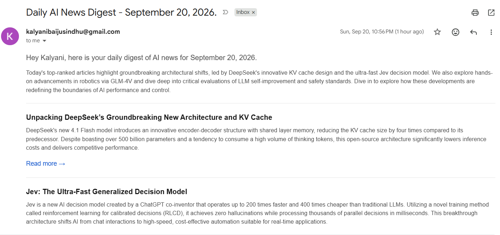
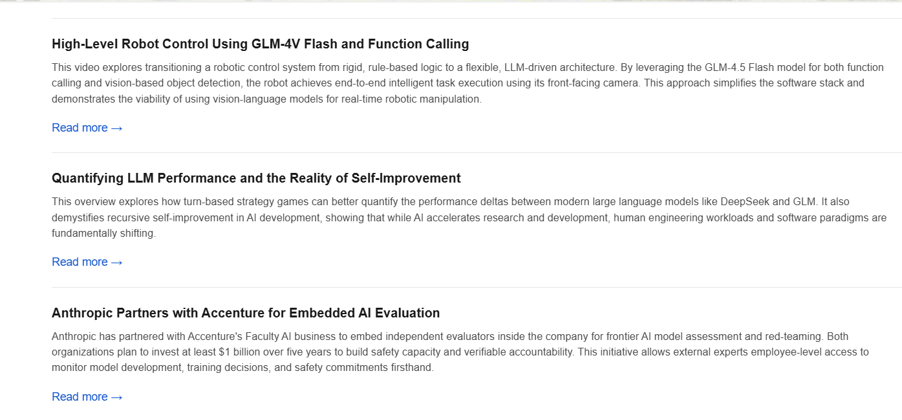
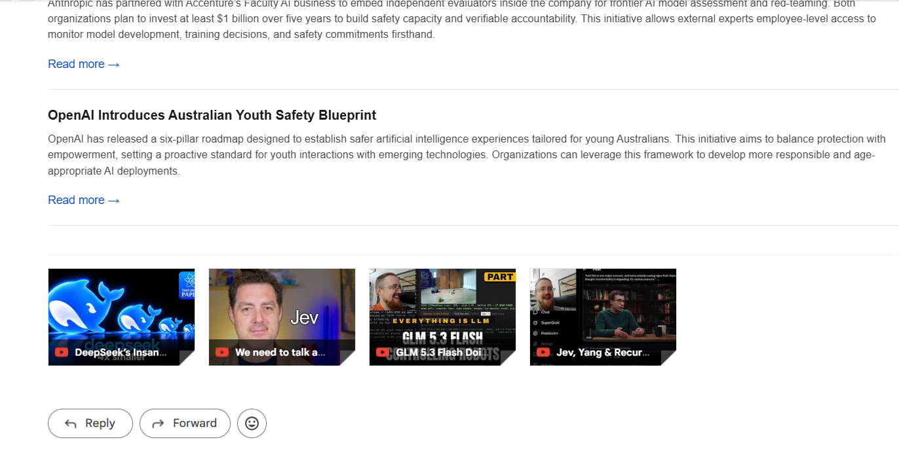

# AI News Aggregator

A daily digest pipeline that follows AI news for me so I don't have to. It scrapes OpenAI, Anthropic, and YouTube, summarizes each item with an LLM, ranks everything against a personal interest profile, and emails the top stories as a formatted digest.

## What it produces

Each morning the pipeline emails the day's top AI stories, ranked against a personal interest profile and summarized down to a few sentences each.



<details>
<summary>See the rest of the digest</summary>





</details>

## How it works

The pipeline is a [LangGraph](https://langchain-ai.github.io/langgraph/) `StateGraph`, and every LLM call is a [LangChain](https://python.langchain.com/) chain that returns a validated Pydantic object:

```
                  +-> extract_anthropic -+
START -> scrape --+                      +-> summarize -> curate_and_deliver -> END
                  +-> extract_youtube ---+

curate_and_deliver (subgraph):
  load_candidates --(no digests)--> END
        |
        v
      rank --> validate --(valid)--> compose_email --> send_email
        ^          |
        +--retry---+--(still invalid)--> fallback_rank --> compose_email
```

1. **Scrape** — pulls the last N hours from three sources: the OpenAI and Anthropic news feeds, and any YouTube channels listed in config. New items are written to Postgres; duplicates are skipped by primary key.
2. **Extract** — two nodes run in parallel: Docling converts Anthropic pages to markdown, and YouTube transcripts are fetched.
3. **Summarize** — a digest chain (Gemini Flash Lite) turns each item into a title and a 2–3 sentence summary, several articles at a time via LangChain's `batch()`.
4. **Rank** — a curator chain (Gemini Flash) scores every digest 0–10 against the user profile. A validation node checks the ranking covers every article exactly once with no invented IDs; if not, the graph loops back to `rank` with the problems as feedback, and after `MAX_RANK_ATTEMPTS` falls back to recency order rather than sending nothing.
5. **Email** — an email chain writes an intro, and the top N articles go out as HTML over SMTP.

See the diagram for your checkout with `uv run python main.py --graph` (Mermaid output). For a guided tour of the design, see [docs/INTERVIEW_GUIDE.md](docs/INTERVIEW_GUIDE.md).

## Project layout

| Path | What's in it |
| --- | --- |
| `app/scrapers/` | Source-specific scrapers: OpenAI, Anthropic, YouTube |
| `app/services/` | One module per pipeline stage |
| `app/agent/` | LangChain model factory and the three agent chains: digest, curator, email |
| `app/graph/` | LangGraph state, nodes, and graph wiring |
| `app/database/` | SQLAlchemy models, repository, connection |
| `app/profiles/` | The interest profile driving ranking |
| `app/daily_runner.py` | Invokes the graph and logs the run summary |
| `tests/` | Offline graph tests (no network, LLM, or database) |
| `run_pipeline.py` | Deployment entrypoint (creates tables, then runs) |

## Setup

Requires Python 3.12+ and [uv](https://docs.astral.sh/uv/).

```bash
uv sync
cp example.env .env
```

Fill in `.env`:

| Variable | Notes |
| --- | --- |
| `GEMINI_API_KEY` | Required. Get one at [aistudio.google.com](https://aistudio.google.com/apikey) |
| `DIGEST_MODEL` / `CURATOR_MODEL` / `EMAIL_MODEL` | Optional overrides. See Models below |
| `MY_EMAIL` / `APP_PASSWORD` | Gmail address and an [app password](https://support.google.com/accounts/answer/185833) — not your account password. Strip the spaces from the 16-character value, and generate it while signed into the same account as `MY_EMAIL` |
| `DIGEST_RECIPIENTS` | Comma-separated. Defaults to `MY_EMAIL` |
| `DATABASE_URL` | Full connection string. Leave blank locally to use the `POSTGRES_*` parts |
| `USER_NAME`, `USER_TITLE`, `USER_BACKGROUND` | Shape how the curator ranks |
| `YOUTUBE_CHANNELS` | Comma-separated channel IDs |

Keep `.env` at the project root. A second `.env` inside `app/` will shadow it for every module in that package, which fails in confusing ways; [app/__init__.py](app/__init__.py) pins loading to the root file to make that harder to trip over.

### Hosted Postgres

For Supabase, use the **Session pooler** string, not Direct connection — the direct host (`db.<ref>.supabase.co`) is IPv6-only and unreachable from most CI and hosting providers, including Render:

```
DATABASE_URL=postgresql://postgres.<ref>:<password>@aws-0-<region>.pooler.supabase.com:5432/postgres?sslmode=require
```

Percent-encode special characters in the password (`@` → `%40`, `#` → `%23`, `/` → `%2F`).

### Local Postgres

Start Postgres and create the schema:

```bash
docker compose -f docker/docker-compose.yml up -d
uv run python -m app.database.create_tables
```

## Running it

```bash
uv run python main.py            # last 24 hours, top 10 articles
uv run python main.py 48 15      # last 48 hours, top 15
uv run python main.py --dry-run  # write output/digest_preview.html instead of emailing
uv run python main.py --graph    # print the pipeline graph as Mermaid
uv run pytest                    # offline tests for routing, retry, and fallback
```

Individual stages run standalone, which is useful when debugging one part:

```bash
uv run python -m app.runner                  # scrape only
uv run python -m app.services.process_digest # summarize only
uv run python -m app.services.process_email  # rank and send only (add --dry-run to preview)
```

## Deploying to Render

The pipeline is a scheduled batch job, not a web service, so it deploys as a Render **Cron Job**. The database lives outside Render (Neon, Supabase, or any managed Postgres). The job is declared in `render.yaml`.

1. Create a Postgres database with your provider and copy its connection string.
2. Push this repo to GitHub.
3. In Render, choose **New > Blueprint** and point it at the repo. It reads `render.yaml` and creates the cron job.
4. Set the secrets marked `sync: false` in the Render dashboard: `DATABASE_URL` (the connection string from step 1), `GEMINI_API_KEY`, `MY_EMAIL`, `APP_PASSWORD`, `DIGEST_RECIPIENTS`, `USER_NAME`, `YOUTUBE_CHANNELS`.
5. Trigger a manual run from the dashboard to verify, then let the schedule take over.

The default schedule is `0 6 * * *` — 06:00 UTC daily. Render cron schedules are always UTC, so adjust the hour for your timezone. `run_pipeline.py` calls `create_tables()` on every run, so the first run provisions the schema itself.

A run that finds no new articles is a success, not a failure: it logs `Email: Nothing to send` and exits 0, so quiet days do not show as failed cron runs. Note that a digest's lookback window is measured against the article's **publication** time, not when it was processed, so a 24-hour window only catches articles published in the last 24 hours.

Notes on the deployment shape:

- **Docker, not a native Python runtime.** Docling pulls in torch, transformers, and OpenCV, which need system libraries (`libgl1`, `libglib2.0-0`) that the Dockerfile installs.
- **Cron job, not a web service.** There is no HTTP surface, and a full run takes minutes — well past the request timeouts that serverless platforms impose. This is also why it won't deploy to Vercel.
- **External database.** Keeping Postgres off Render avoids the free plan's expiry and keeps the data portable. Any provider works as long as `DATABASE_URL` is reachable and allows SSL connections.

## Models

Runs on the Gemini API. Each agent's model is set by an environment variable, so they can be swapped without touching code:

| Variable | Default | Why |
| --- | --- | --- |
| `DIGEST_MODEL` | `gemini-3.5-flash-lite` | One call per article, so this drives volume. Cheapest tier is the right fit |
| `CURATOR_MODEL` | `gemini-3.5-flash` | Ranking is the reasoning-heavy step, but runs once per pipeline |
| `EMAIL_MODEL` | `gemini-3.5-flash` | Writes the intro, once per pipeline |

Google retires model names faster than most providers, and a stale name fails at runtime with a `404 ... no longer available`. To see what a key can currently reach:

```bash
uv run python -c "from app.agent.client import get_client; [print(m.name) for m in get_client().models.list()]"
```

Transient `503 UNAVAILABLE` responses are common on the Flash models. Every Gemini call retries with exponential backoff inside the Google SDK (`max_retries` on `ChatGoogleGenerativeAI`) and then LangChain's `with_fallbacks()` reruns it on a second model, so a spike no longer loses a whole run. Tune with `GEMINI_MAX_ATTEMPTS` (default 4) and `GEMINI_FALLBACK_MODEL`.

Set `LANGSMITH_TRACING=true` and `LANGSMITH_API_KEY` to trace every graph node and LLM call in LangSmith.

Note that the list endpoint advertises models that `generateContent` will still refuse, so confirm with a real call before relying on one. The Pro tier models return `429 RESOURCE_EXHAUSTED` on a free API key — stick to Flash unless the key is on a paid plan.

## Cost

One Flash Lite call per article plus two Flash calls per run. Comfortably inside the Gemini free tier for a handful of sources a day.
